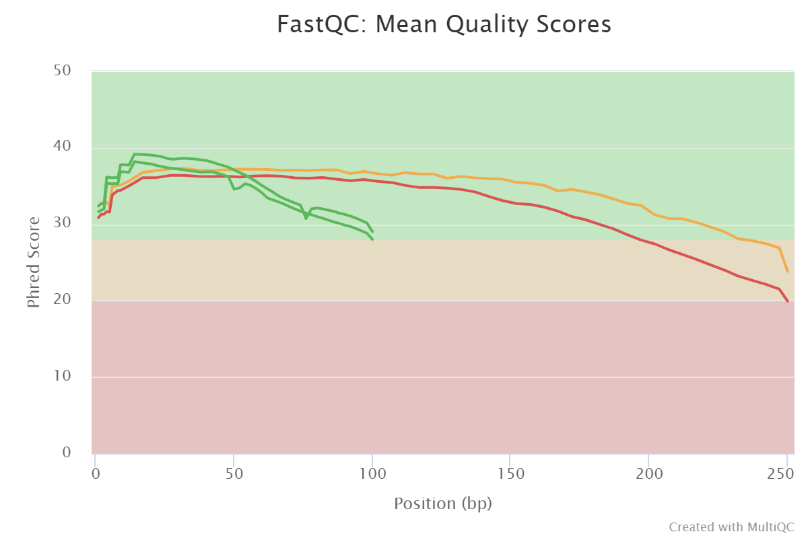
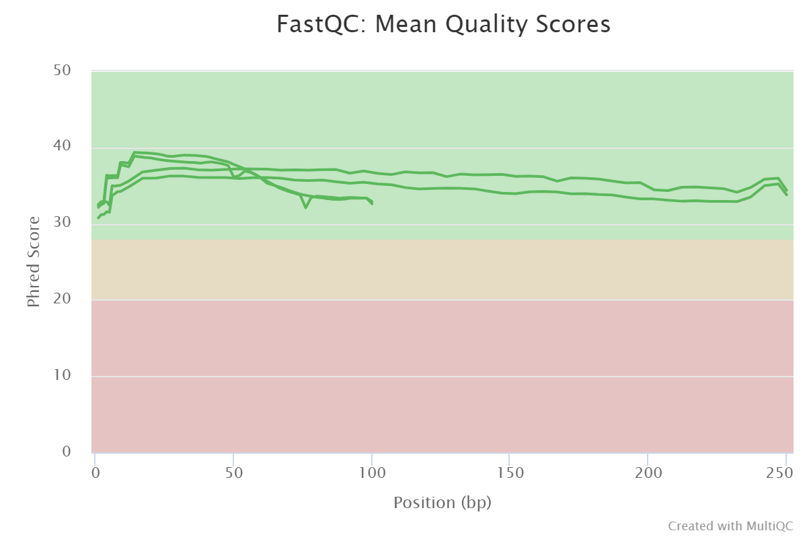
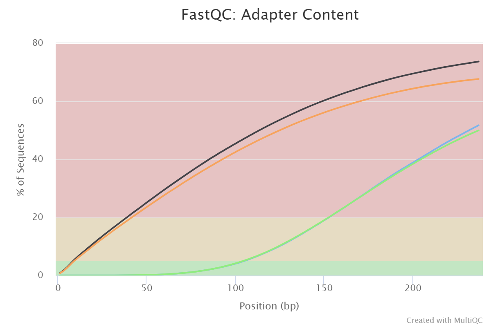
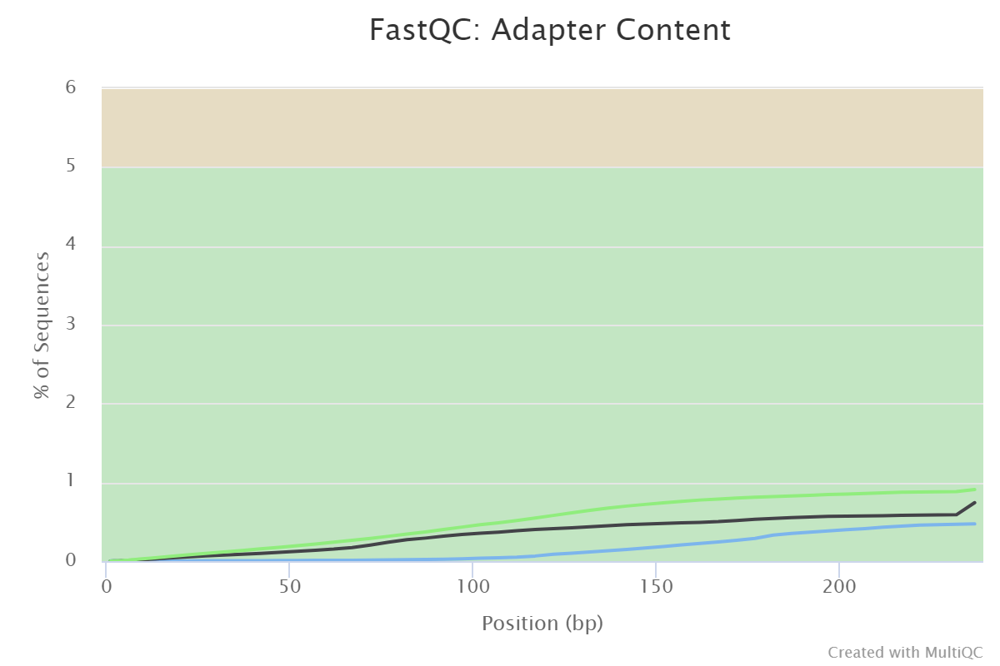
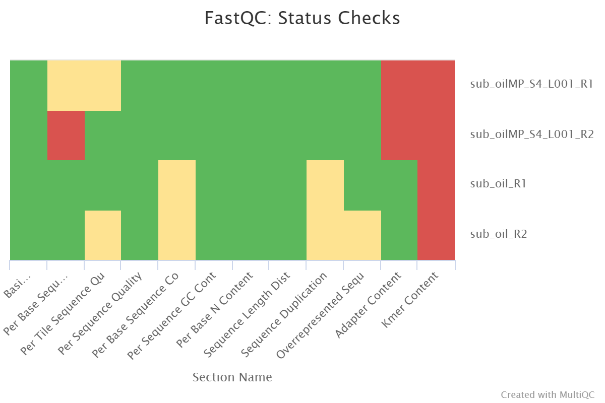
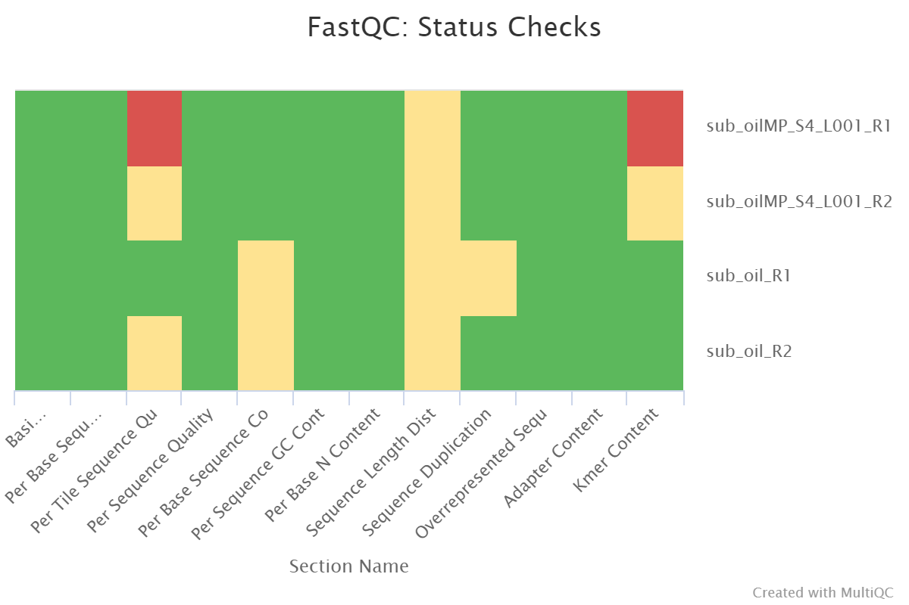

# hse21_hw1
 *Thalassolituus oleivorans* genome assembly

## Список всех выполненных команд
```bash
mkdir HW1
ln -s /usr/share/data-minor-bioinf/assembly/oil_R1.fastq
ln -s /usr/share/data-minor-bioinf/assembly/oil_R2.fastq
ln -s /usr/share/data-minor-bioinf/assembly/oilMP_S4_L001_R1_001.fastq
ln -s /usr/share/data-minor-bioinf/assembly/oilMP_S4_L001_R2_001.fastq
seqtk sample -s36 oil_R1.fastq 5000000 > sub_oil_R1.fastq
seqtk sample -s36 oil_R2.fastq 5000000 > sub_oil_R2.fastq
seqtk sample -s36 oilMP_S4_L001_R1_001.fastq 1500000 > sub_oilMP_S4_L001_R1_001.fastq
seqtk sample -s36 oilMP_S4_L001_R2_001.fastq 1500000 > sub_oilMP_S4_L001_R2_001.fastq
fastqc sub_oil_R1.fastq
fastqc sub_oil_R2.fastq
fastqc sub_oilMP_S4_L001_R1_001.fastq
fastqc sub_oilMP_S4_L001_R2_001.fastq
multiqc .
platanus_trim sub_oil_R1.fastq sub_oil_R2.fastq
platanus_internal_trim sub_oilMP_S4_L001_R1_001.fastq sub_oilMP_S4_L001_R2_001.fastq
mkdir trim
mv -v *trimmed trim
cd trim
mkdir reports
ls | xargs -P 1 -tI{} fastqc -o reports {}
multiqc reports -o reports
platanus assemble -o Poil -t 1 -m 16 -f sub_oil_R1.fastq.trimmed sub_oil_R2.fastq.trimmed 2> assemble.log
platanus scaffold -o Poil -t 1 -c Poil_contig.fa -IP2 sub_oil_R1.fastq.trimmed sub_oil_R2.fastq.trimmed -OP2 sub_oilMP_S4_L001_R1_001.fastq.int_trimmed sub_oilMP_S4_L001_R2_001.fastq.int_trimmed 2> scaffold.log
platanus gap_close -o Poil -t 1 -c Poil_scaffold.fa -IP2 sub_oil_R1.fastq.trimmed sub_oil_R2.fastq.trimmed -OP2 sub_oilMP_S4_L001_R1_001.fastq.int_trimmed sub_oilMP_S4_L001_R2_001.fastq.int_trimmed 2> gapclose.log
```

## Статистика multiQC
[*Полный отчёт по исходным (неподрезанным) чтениям*](/data/reports/multiqc_non-trimmed.html)\
[*Полный отчёт по подрезанным чтениям*](/data/reports/multiqc_trimmed.html)

#### General Statistics
###### Non-Trimmed
Sample Name |	% Dups |	% GC |	Length |	% Failed |	M Seqs
-|-|-|-|-|-
sub_oilMP_S4_L001_R1_001 |	4.5% |	44% |	251 bp |	17% |	1.5
sub_oilMP_S4_L001_R2_001 |	4.0% |	44% |	251 bp |	25% |	1.5
sub_oil_R1 |	32.0% |	46% |	101 bp |	8% |	5.0
sub_oil_R2	| 30.7%	| 46%	| 101 bp |	8% |	5.0

###### Trimmed
Sample Name |	% Dups |	% GC |	Length |	% Failed |	M Seqs
-|-|-|-|-|-
sub_oilMP_S4_L001_R1_001 |	2.4% |	46% |	111 bp |	17% |	0.9
sub_oilMP_S4_L001_R2_001 |	2.1% |	45% |	105 bp |	0% |	0.9
sub_oil_R1 |	30.3% |	46% |	97 bp |	0% |	4.8
sub_oil_R2	| 29.3%	| 46%	| 96 bp |	0% |	4.8

#### Sequence Quality Histograms
###### Non-Trimmed

###### Trimmed

#### Adapter Content
###### Non-Trimmed

###### Trimmed

#### Status Checks
###### Non-Trimmed

###### Trimmed



## [Jupyter Notebook с кодом](/src/HW1.ipynb)

## Результаты (скопировано из ноутбука)

#### Statistics for contigs
Number of sequences: 609\
Total length: 3925016\
The size of the longest sequence: 179307\
N50: 47611

#### Statistics for scaffolds
Number of sequences: 95\
Total length: 3870305\
The size of the longest sequence: 383603\
N50: 169882\
Number of gaps: 3\
The gaps themselves:  ['N', 'NNNNNNNNNNNNNN', 'NNNNNNNNNNNNNNNNNNNNNNNNN']\
Total length of gaps: 40

#### Statistics for gapClosed
Number of sequences: 95\
Total length: 3870322\
The size of the longest sequence: 383574\
N50: 169882\
Number of gaps: 0\
The gaps themselves:  []\
Total length of gaps: 0
